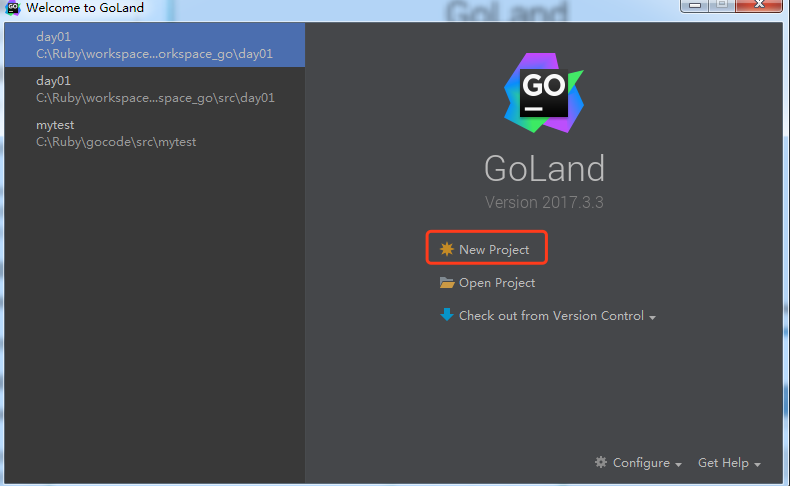
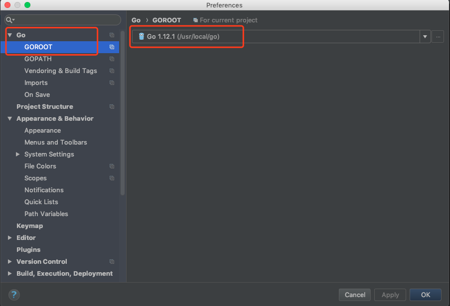
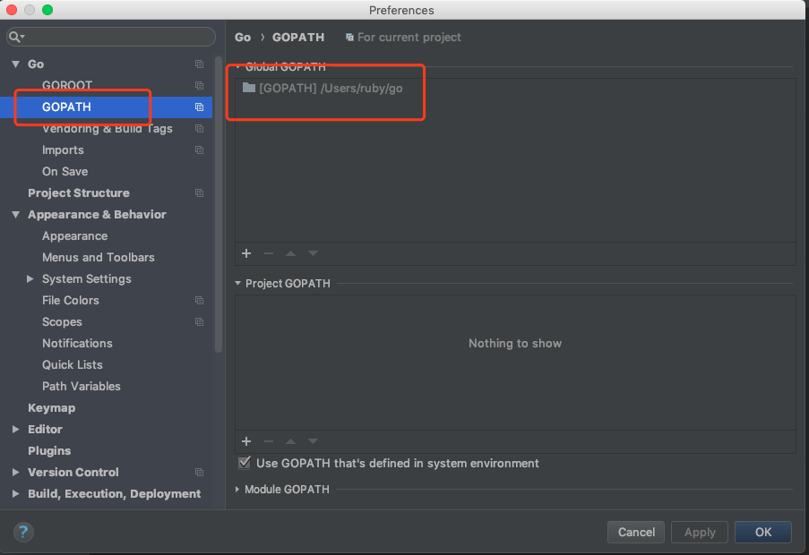
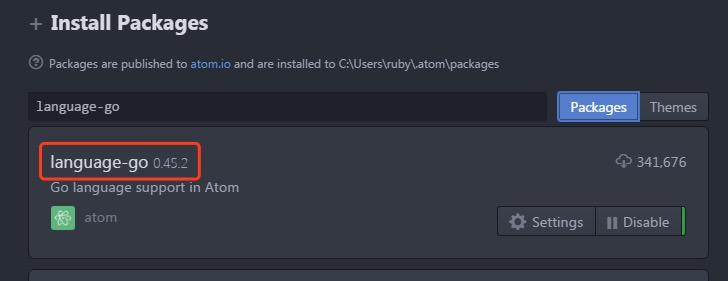

# Install Goland development tools
> @author：Han Ru
> Copyright: Beijing Qianfeng Internet Technology Co., Ltd.
development tools:
Text editors: notepad, notepad, sublime text, atom. . .
​ Execute the program by command
IED: integrated development environment (integrated development environment)
​ goland
## 1.1 Using Goland
Goland is the Go language IDE launched by JetBrains. It is a powerful and easy-to-use product.
Download link: <http://www.jetbrains.com/go>
For both Mac and Windows, there are direct installation files. After double-clicking directly, the installation is foolish, all the way to next until it is completed.
Open Goland tool, goland activation code: http://idea.iblue.me
New Go project:

Create project:

Goland configuration goroot:

Configure gopath:

```
Goland commonly used shortcut keys
File related shortcuts:
CTRL+E, open the recently browsed file.
CTRL+SHIFT+E, open the recently changed file.
CTRL+N, you can quickly open the struct structure.
CTRL+SHIFT+N, you can quickly open the file.
Code formatting:
CTRL+ALT+T, you can wrap the code in a block, such as if{...}else{...}.
CTRL+ALT+L, format the code.
CTRL+Space, code prompt.
CTRL+/, single-line comment. CTRL+SHIFT+/, make multi-line comments.
CTRL+B, quickly open the structure or method at the cursor (jump to the definition).
CTRL+"+/-", you can expand or collapse the current method.
Find and locate
CTRL+R, replace text.
CTRL+F, find text.
CTRL+SHIFT+F, perform a global search.
CTRL+G, quickly locate a certain line.
Code edit
ALT+Q, you can see the declaration of the current method.
CTRL+Backspace, delete by word.
SHIFT+ENTER, you can insert a new line down, even if the cursor is in the middle of the current line.
CTRL+X, delete the line where the current cursor is located.
CTRL+D, copy the line where the current cursor is located.
ALT+SHIFT+UP/DOWN can move the code of the line where the cursor is up and down.
CTRL+SHIFT+U, you can convert the selected content to case.
```
**Install GoLand tool under Ubuntu**
First download the GoLand software to the download folder. Then enter the following command in the terminal:
```shell
ruby@ubuntu:~/download$ sudo tar -xzf goland-2017.3.3.tar.gz -C /opt
```
Enter the bin directory and execute the following command:
```shell
ruby@ubuntu:/opt/GoLand-2017.3.3/bin$ sh goland.sh
```
## 1.2 Using atom
Install the atom tool, and then install the go-plus plugin and atom-terminal-panel and other plugins.
1. Install the go-plus plug-in. This plug-in provides support for almost all go language development in Atom, including tools, build flows, linters, vet and coverage tools. It also contains many code snippets and some other features.

2.language-go

3. Install the file-icon plug-in, which provides a large number of icon displays for files with different suffixes.

4. Set font size, etc.

## 1.3 Other development tools
Such as sublime text, editplus, notpad++, eclipse and so on. .
Qianfeng Go language learning group: 784190273
Corresponding video address:
Https://oooooo.proportion.com/video/av56018934
Https://oooooo.proportion.com/video/av47467197
Source code:
HTTPS://GitHub.com/Ruby with 1314/go_foundation
#
