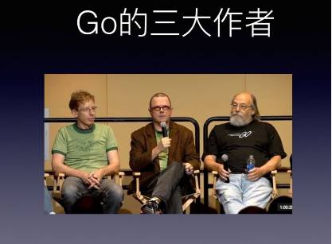
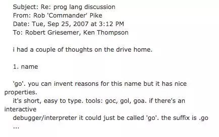
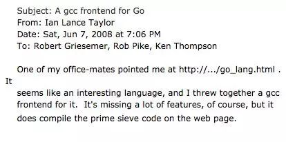
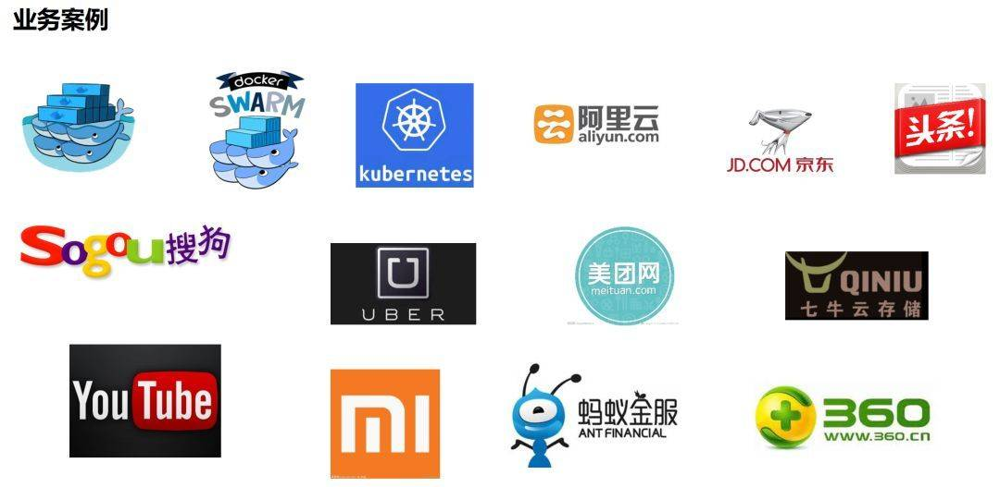

# The past and present of Go language
> @author：Han Ru
> Copyright: Beijing Qianfeng Internet Technology Co., Ltd.

## 1. Why a new language is needed
In the past ten years, C/C++ has not developed well in the field of computing, and no new system programming languages ​​have appeared. In many cases, the degree of development and system efficiency cannot have both. Either the execution efficiency is high, but inefficient development and compilation, such as C++; or the execution efficiency is low, but has an effective compilation, such as .NET, Java; so there is a need for a more efficient execution speed, compilation speed and development speed Programming language, Go turned out.
> For traditional languages ​​such as C++, everyone spends too much time learning how to use this language instead of how to better express the author’s thoughts. At the same time, compilation takes too long. For the write-compile-run chain Said the cycle is too long. Dynamic languages ​​such as Python have no strong typing constraints, so many problems need to be discovered at runtime. Such low-level errors should be found by the compiler.
-Labor costs are getting higher and higher
-Machines are getting cheaper
-The performance of the machine is getting better
-Achieve a balance between development efficiency and operating speed
Before the advent of go, neither assembly language nor dynamic scripting language could have both execution efficiency and development efficiency.
> Execution efficiency execution speed: C/C++> Java> PHP
> Developing efficiency: PHP> Java> C/C++
## 2. 20% of the time of Google engineers
Google’s "20% of the time" work method allows engineers to spend 20% of their time on projects they like. Voice services Google Now, Google News, Google News, and traffic information on Google Maps and Google Maps are all 20% of the time.
The Go language was also a product of 20% of the time.
## 3. Founder
The three authors of Go are Rob Pike, Ken Thompson and Robert Griesemer.
-Rob Pike: He was a member of the Unix team at Bell Labs and the Plan 9 operating system project. He has worked with Thompson for many years and co-created the widely used UTF-8 character encoding.
-Ken Thompson: Mainly the author of B language, C language, father of Unix. Winner of the Turing Award in 1983 and the National Medal of Technology in 1998. He and Dennis Ritchie are the original creators of Unix. Thompson also invented the B programming language that later derived the C language.
-Robert Griesemer: Before the development of Go, he was a major contributor to Google V8, Chubby and HotSpot JVM.

> In addition, there are Plan 9 developer Russ Cox, and Ian Taylor, who improved the GCC, a widely used open source compiler.
## Fourth, the creation and development of Go
### 4.1 Naming of Go

This is an email from Rob Pike to Robert Griesemer and Ken Thompson on the topic of programming language discussions on Tuesday, September 25, 2007, at 3:12 pm. The body of the email reads: I got Some inspiration. 1. Name this programming language "go", it is short and easy to write. Tools can be named: goc, gol, goa. The interactive debugging tool can also be named "go" directly. The language file extension is .go etc.
This is the source of the name of the Go language. Since then, Robert, Rob and Ken have started to conduct research and development within Google. Until 2009, Go was officially open sourced. The Go project team will be the language on November 10, 2009. The Japanese word officially opened to the outside world as its official birthday. The source code was originally hosted on [http://code.google.com](http://link.zhihu.com/?target=http%3A//code.google.com), and then gradually migrated over the next few years Go to GitHub.
### 4.2 Notes in the development of Go
**The first thing is that the first major surprise in the process of developing and designing the Go language is the following email:**

This is an email about the front end of the Go gcc compiler written by Ian Lance Taylor to Robert Griesemer, Rob Pike, and Ken Thompson at 7:06 pm on June 7, 2008 (Saturday). The main body of the email is as follows: my colleague recommended this website to me http://.../go_lang.html. This seems to be a very interesting programming language. I wrote a gcc compiler front end for it. Although this tool still lacks many functions, it can indeed compile the prime number screening program shown on the website.
The addition of Ian Lance Taylor and the implementation of the second compiler (gcc go) brought shock and joy. This is not only an encouragement for the Go project, but also a proof of feasibility. The second implementation of the language is critical to the process of formulating language specifications and determining the standard library, and it also helps to ensure its high portability, which is also part of the promise of the Go language. Since then, Ian Lance Taylor has become the core figure in the design and implementation of the Go language and its tools.
**The second thing is that Russ Cox joined the newly established Go team in 2008 with his language design talent and programming skills. **Russ discovered that the universality of Go methods means that functions can also have their own methods, which directly contributed to the realization of **http.HandlerFunc**, which is a feature that makes Go all at once infinite possibilities. Russ also put forward more generalization ideas, such as io.Reader and io.Writer interfaces, which laid the overall structure of all I/O libraries.
**The third thing is to hire security expert Adam Langley to help Go to the world outside of Google. **Adam did a lot of work for the Go team that is not known to outsiders, including creating the original **http://golang.org** website and **build dashboard**. However, his biggest contribution is the creation of the cryptographic library. At first, in the eyes of some of us, this library was insignificant in terms of scale and complexity. But it was this library that became the foundation of many important network and security software in the later period, and became a key part of the history of Go language development. Many network infrastructure companies, such as **Cloudflare**, rely heavily on Adam's work on the Go project, and the Internet has become better because of it. I remember that when beego was designed, Adam's advice was also received when designing the session module. Therefore, as far as Go is concerned, we sincerely thank Adam.
**The fourth thing is a company called Docker. **It is to use Go for project development, and promote the container industry in the computer field, and then projects like Kubernetes have appeared. Now, we can say that Go is a container language, which is another completely unexpected result.

Except for the famous Docker, it is completely implemented with GO. The industry's most popular container orchestration management system kubernetes is completely implemented in GO. Later, Docker Swarm was completely implemented with GO. In addition, there are various famous projects, such as etcd/consul/flannel, Qiniu cloud storage, etc.
All are implemented using GO. Some people say that the GO language is famous because it has caught up with the cloud era. But why can't you put it another way? It is also the GO language that promotes the development of cloud.
In addition to cloud projects, there are companies like Toutiao and UBER, who have also used GO language to completely restructure their business.
## Five, finally
Go language is the second open source programming language (system development language) released by Google in 2009. It is a programming language based on compilation, garbage collection and concurrency.
Go language is optimized for the programming of multi-processor system applications. Programs compiled with Go can be comparable to the speed of C/C++ code, and are safer and support parallel processes. As a language that appeared in the 21st century, its near-C execution performance, near-analytic language development efficiency, and near-perfect compilation speed have become popular all over the world. Especially in cloud projects, most of them are developed using Golang. I have to say that Golang has long been deeply rooted in people's hearts. For a new project without historical burden, Golang may be the best choice.
Many people call the Go language the C language of the 21st century, because Go not only has the simplicity and performance of C. It also provides various practical features for server development in the 21st century Internet environment. Rob Pike, known as the father of the Go language, once said that whether you agree with the Go language depends on whether you agree that less is more or less is less (Less is more or less is less). The entire design philosophy of the Go language is to fully embody simplicity and practicality.
Now Go is already a cloud computing programming language. Go language is backed by the big tree of Google, and there are no shortage of great people. It is a veritable "second generation of cows". Imagine: a programming language with only a dozen years of development experience has become the leader of such a huge and growing industry. This kind of success is unimaginable for everyone.
All pictures in this article are from the Internet, invaded and deleted
Qianfeng Go language learning group: 784190273
Corresponding video address
Https://oooooo.proportion.com/video/av47467197
Https://oooooo.proportion.com/video/av56018934/
Source code
HTTPS://GitHub.com/Ruby with 1314/go_foundation
