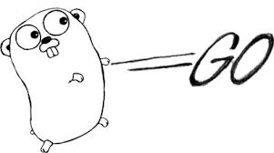
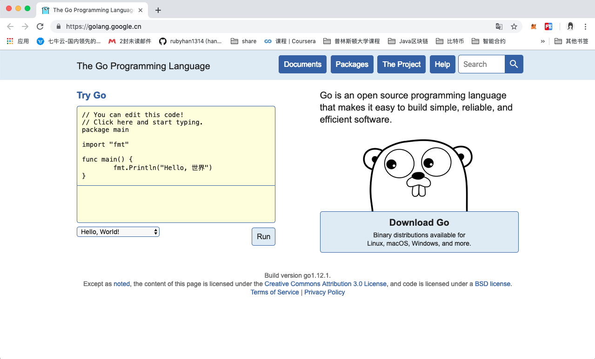

# Go language logo and version
> @author：Han Ru
> Copyright: Beijing Qianfeng Internet Technology Co., Ltd.
## One, Go logo
### 1.1 Go language logo

The Go language logo is a very simple two-letter GO.
### 1.2 Go's mascot

The reason why Go is called Go is to express that the running speed, development speed, and learning speed of this language (develop) are as fast as gopher.
Gopher is a small animal that lives in Canada. The mascot of go is this small animal. Its Chinese name is saccharomyces. Their biggest feature is that they dig holes very fast. Of course, they may not only dig holes.

## 2. [Go's official website](https://golang.google.cn/)

## Three, the main development process of Go language
-In September 2007, prototype design, Rob Pike (Rob. Parker) officially named Go;
-In May 2008, Google fully supported the project;
-On November 10, 2009, the first public release, Go open source all the code, it won the language of the year;
-On March 16, 2011, the first stable version of Go, r56, was released.
-On March 28, 2012, the first official version of the Go language, Go1, was released.
-On April 04, 2013, the first Go 1.1beta1 beta version of the Go language was released.
-On April 08, 2013, the second Go 1.1beta2 beta version of the Go language was released.
-On May 02, 2013, Go 1.1RC1 version of Go language was released.
-On May 07, 2013, Go 1.1RC2 version was released.
-On May 9, 2013, Go 1.1RC3 version of Go language was released.
-On May 13, 2013, the official version of Go 1.1 was released.
-On September 20, 2013, Go 1.2RC1 version was released.
-On December 1, 2013, the official version of Go language Go 1.2 was released.
-On June 18, 2014, Go 1.3 version of the Go language was released.
-On December 10, 2014, Go 1.4 version was released.
-On August 19, 2015, the Go language Go 1.5 was released, and the "last remaining C code" was removed in this update.
-On February 17, 2016, Go 1.6 was released.
-On August 15, 2016, the Go language Go 1.7 was released.
-On February 17, 2017, the Go language Go 1.8 was released.
-On August 24, 2017, the Go language Go version 1.9 was released.
-On February 16, 2018, Go 1.10 was released.
-On August 24, 2018, Go 1.11 version was released.
-On February 25, 2019, the GO language Go 1.12 version was released.
The Go language originated in 2007 and was officially released in 2009. It started on September 21, 2009 as a 20% part-time project of Google, that is, relevant employees use 20% of their free time to participate in the development of the Go language.
In fact, you can see that the history of Go language is not very short.
November 2009 The first version of GO language was released. In March 2012, the first official version Go1.0 was released.
In August 2015, go1.5 was released, and this version is considered historic. Completely remove the C language part, use GO to compile GO, and use assembly for a small amount of code. In addition, they invited Rick Hudson, an authoritative expert in memory management, to redesign the GC, support concurrent GC, and solve the GC time delay (STW) problem that has been widely criticized. And in subsequent versions, GC has been further optimized. By go1.8, the GC delay in the same business scenario can already be controlled within 1ms from a few seconds of go1.1. To solve the GC problem, it can be said that the GO language has almost smoothed out all the weaknesses in server-side development.
Until February 25 this year, the latest version of the Go language released is Go 1.12.
During the iteration of the GO language, the language features basically did not change much, basically maintaining the GO1.1 benchmark, and the official promise that the new version is fully compatible with the code developed under the old version. In fact, the GO development team is very cautious in adding language features, and has continued to optimize in terms of stability, compilation speed, execution efficiency, and GC performance.
> When the Go stable version is released, Go Team promises that subsequent versions will be compatible with the previous version. This is very important for developers, and subsequent versions of Go have been improving their internal capabilities, allowing users to seamlessly upgrade the Go version.

Some pictures in this article are from the Internet, invaded and deleted
Qianfeng Go language learning group: 784190273
Corresponding video address:
Https://oooooo.proportion.com/video/av47467197
Https://oooooo.proportion.com/video/av56018934/
Source code:
HTTPS://GitHub.com/Ruby with 1314/go_foundation
