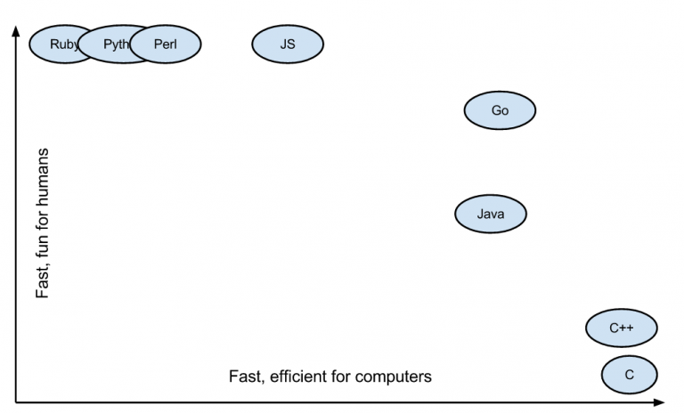
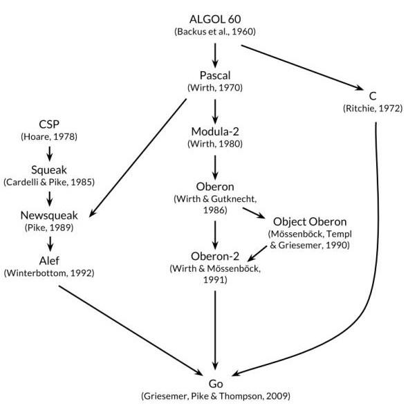

# Comparison of Go language and other languages
> @author：Han Ru
> Copyright: Beijing Qianfeng Internet Technology Co., Ltd.
## 1. The original intention of Go language design
1. The Go language was designed to solve the problems encountered by Google development at the time:
-A lot of C++ code, while introducing Java and Python
-Thousands of engineers
-Thousands of lines of code
-Distributed compilation system
-Millions of servers
2. Pain points in Google development:
-Slow compilation
-Out of control dependence
-Every engineer uses only part of a language
-The program is difficult to maintain (poor readability, unclear documentation, etc.)
-The cost of updates is getting longer and longer
-Cross compilation is difficult
3. How to solve the current problems and pain points?
-Go hopes to become the C language in the Internet age. The fundamental programming philosophy of most system-level languages ​​(including Java and C#) comes from C++, which further develops the object-oriented approach of C++. But the designers of the Go language have a different view. They believe that the C language is worth learning. The root of the enduring C language is that it is simple enough. Therefore, the Go language is simple enough.
-So, their goal when designing Go was to eliminate all kinds of slowness and cumbersomeness, and improve all kinds of inefficiencies and scalability. Go is designed by those who develop large-scale systems, and it is also for these people; it is to solve engineering problems, not to study language design; it is to make our programming more comfortable and convenient.
-But combined with some internal realities of Google at the time, for example, many engineers are of the C series, so the newly designed language must be easy to learn, preferably a language similar to C; no new language has been released in 20 years, so the new design The language must be modern (such as built-in GC) and so on. Finally, based on actual combat experience, they designed the Go language toward the goal.
4. Features of Go language:
-Object-oriented without inheritance polymorphism
-Strongly consistent type
-Interface does not need to be explicitly declared (Duck Typing)
-No exception handling (Error is value)
-Accessibility based on initials
-Unused imports or variables cause compilation errors
-Complete and excellent standard library package
-Go built-in runtime (function is performance monitoring, garbage collection, etc.)
## Second, the advantages of Go language
1. Easy learning curve
​ The syntax of Go language is simple, including C-like syntax. Because the Go language is easy to learn, an ordinary college student can write a high-performance application that can be used in a few weeks. Everyone in China pursues fast, which is one of the reasons why Go is popular in China.
​ 
> The grammatical features of Go language are simply too simple, so simple that you can hardly play any tricks, go straight, the learning curve is very low, and it is very fast to learn.
2. Efficiency: fast compilation time, high development efficiency and operating efficiency
​ Compared to the sluggish compilation speed of Java and C++ during development, Go's fast compilation time is a major efficiency advantage. Go has operating efficiency close to C and development efficiency close to PHP.

The philosophy of the C language is to trust the programmer, keep the language small, not shield the bottom layer and be friendly, and focus on the efficiency and performance of the language. The attitude of Python is to accomplish as many things as possible with as little code as possible. So I can feel that Go language wants to unify C and Python, which is a great thing.

3. Famous background and pure blood
​ The reason why Go comes from a famous family can be seen from the creator of the Go language. The Go language is absolutely pure. Secondly, the Go language comes from Google. Google's popularity and strength in the industry needless to say. Google has gathered a group of great talents to launch a new programming language in a situation where various programming languages ​​dominate and compete for hegemony. Naturally, it has its strategic considerations. And judging from the development trend of the Go language, Google still values ​​its new darling, and Go naturally has a good future for development.

4. Free and efficient: combined thinking, non-intrusive interface
​ The Go language can be said to be a perfect fusion of development efficiency and operational efficiency, with natural concurrent programming support. Go language supports all current programming paradigms, including procedural programming, object-oriented programming, interface-oriented programming, and functional programming. Programmers can choose what they need, combine freely, and play whatever they want.
​
5. Powerful standard library
​ This includes Internet applications, system programming and network programming. The standard library in Go is basically very stable, especially the three libraries I mentioned here, the network layer and the system layer are very practical. **Go's lib library is small and complete. **There are basically most commonly used libraries in the lib library of the Go language. Although some libraries are not very good, I think it is not a problem, because I believe that these problems will be solved in the future development.
6. Easy to deploy: Binary files, Copy deployment
​ This is the biggest reason many people choose Go, because deployment is too convenient, so now many people use Go to develop operation and maintenance programs.
7, simple concurrency
**Parallel and asynchronous programming is almost painless. **Goroutine and Channel two artifacts of the Go language are simply a great gospel of concurrent and asynchronous programming. The concurrency and asynchronous modes of languages ​​such as C, C++, Java, Python, and JavaScript are too controlled to be more complicated and error-prone. Go solves this problem very elegantly and smoothly. For programmers who have been tortured by concurrency and asynchrony for many years, this is completely a bright feeling. Go is a very efficient language and highly supports concurrency. Go is a programming language born for big data, microservices, and concurrency.
-Go as a language strives to make things simple. It does not introduce many new concepts, but focuses on creating a simple language that is extremely fast and easy to use. The only innovation is goroutines and channels. Goroutines are a lightweight thread-oriented approach in Go, and channels are the preferred way of communication between goroutines.
-The cost of creating Goroutines is very low, requiring only a few thousand bytes of additional memory. Because of this, it is possible to run hundreds or even thousands of goroutines at the same time. The communication between goroutines can be realized by means of channels. Goroutines and channel-based concurrency methods make it very easy to use all available CPU cores and handle concurrent IO. Compared to Python/Java, running a function on a goroutine requires minimal code.

8. Stability
​ Go has a powerful compilation check, strict coding standards and complete software life cycle tools, with strong stability, stability is overwhelming. So why is Go more stable than other programs? This is because Go provides tools for all aspects of the software life cycle (development, testing, deployment, maintenance, etc.), such as go tool, gofmt, and go test.
## Three, compare other languages
Many language features of Go are borrowed from its three ancestors: C, Pascal and CSP. Go's grammar, data types, control flow, etc. are inherited from C. Go's package and object-oriented ideas are derived from the Pascal branch. The biggest language feature of Go, the coroutine concurrency model based on pipeline communication, is borrowed from the CSP branch.

### Java
Compiled language, moderate speed (2.67s), current large websites are written in java, such as Taobao, Jingdong, etc. The main features are stability, good open source, with its own set of writing specifications, moderate development efficiency, and the most mainstream language at present.
> As a major player in programming languages. Has the greatest popularity and user base. No matter what the wind is surging, I stand still. He forced him to be strong, and the breeze blew the hills and hills;
### c#
The execution speed is fast (4.28), the learning difficulty is moderate, and the development speed is moderate. However, due to the many shortcomings of c#, the predecessors of large websites such as JD.com and Ctrip were developed in c#, but they have now been migrated to java.
### C/C++
The ancestors of existing programming languages, other languages ​​were born from this. The fastest execution speed is unmatched. However, it is the most complicated to write and difficult to develop.
### Javascript
A maverick beauty in programming languages. The front-end processing power is unmatched by other languages. The developing js back-end processing capabilities are also outstanding. Take the front and the back end, who is it?
### Python
Script language, the slowest (258s), the code is simple, the learning progress is short, and the development speed is fast. Douban is written in python. Python's famous server frameworks are django and flask. But python is not stable on large projects, so some companies using python later migrated to java.
### scala
The compiled language is ten times faster than python and almost like java, but the learning progress is slow, and in actual programming, if you are not proficient in the language, it is easy to cause serious performance degradation. , Later, for example, Yammer migrated from scala to java. Microservice frameworks include lagom and so on.
### Go
Little fresh meat in the programming world. High concurrency is unmatched. It has concise code and development speed like Python, and execution efficiency like C language, with outstanding advantages.
## Fourth, finally
Because the syntax of Go is similar to Erlang and Python, we will make a detailed comparison of these three languages.
Compared with the 40 features of Python, Go has only 31. It can be said that Go is quite restrained in language design. For example, it has no implicit numeric conversion, no constructor and destructor, no operator overloading, no default parameters, no inheritance, no generics, no exceptions, no macros, no function modification, and no thread-local storage.
But the characteristics of Go are also very distinct. For example, it has coroutines, automatic garbage collection, package management system, first-class citizen functions, stack space management, etc.
As a statically typed language, Go ensures that Go is stronger than Python and Erlang in terms of operating efficiency, memory usage, and type safety.
Go's data types are also richer. In addition to supporting complex data structures such as tables and dictionaries, it also supports pointers and interface types, which are not available in Python and Erlang. Especially the interface type is particularly powerful, it provides a means to manage the type system. The pointer type provides a means to manage memory, which allows Go to enter the underlying software development and provide strong support.
Go has done a lot of reflections and trade-offs on object-oriented feature support. It has no features such as classes, virtual functions, inheritance, and generics. The core of object-oriented programming in Go language is composition and function. The combination is very similar to the combination of C language struct structure, the method is similar to the Java interface (Interface), but the method of use is more decoupled from the object, reducing the intrusion into the object. Erlang does not support the object-oriented programming paradigm. In contrast, Python has the most comprehensive support for the object-oriented paradigm.
In terms of feature support for functional programming, Erlang, as a functional language, has the most comprehensive support. But basic functional language features, such as lambda, higher-order functions, curry, etc., are supported in all three languages.
The characteristics of control flow support are similar in the three languages. Erlang supports tail recursion optimization, which brings convenience to it in functional programming. And Go supports deep recursive calls by dynamically expanding the coroutine stack. Python is often exploded in deep recursive calls.
Both Go and Erlang's concurrency models are derived from CSP, but Erlang is a concurrent implementation based on actors and messaging (mailbox), and Go is a concurrent implementation based on goroutines and channels. Both Erlang actors and Go goroutines satisfy the characteristics of coroutines: they are implemented and scheduled by a programming language, switching is done in user mode, and the creation and destruction overhead is small. As for Python, its multi-threaded switching and scheduling is based on the operating system, and because of the existence of the GIL, it cannot be truly parallel.
And from the author’s concurrent programming experience, Erlang’s functional programming syntax style and its OTP behavior framework provide obscure callback methods for most programmers, such as programmers from C/C++ and Java. In other words, there are certain thresholds and challenges for entry. As for Go, known as the "C of the Internet Age", its C-like syntax and control flow, and object-oriented programming paradigm, the programming experience is much better.
The picture in this article is from the Internet, invaded and deleted
Qianfeng Go language learning group: 784190273
Corresponding video address:
Https://oooooo.proportion.com/video/av47467197
Https://oooooo.proportion.com/video/av56018934/
Source code:
HTTPS://GitHub.com/Ruby with 1314/go_foundation
