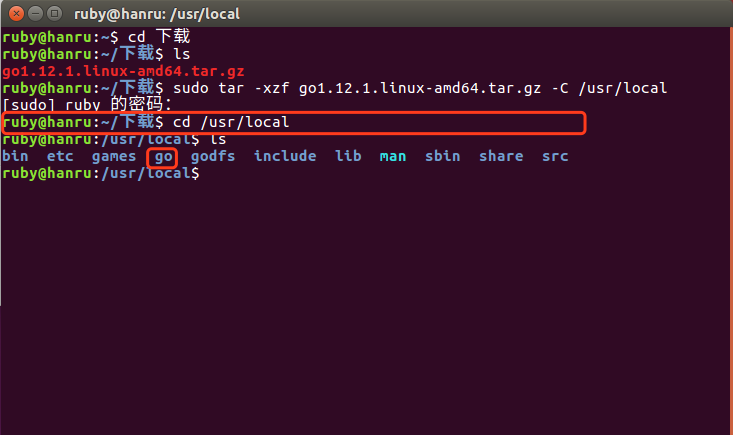

# Go language environment construction
> @author：Han Ru
> Copyright: Beijing Qianfeng Internet Technology Co., Ltd.
## One, the official website of Golang language
First, we log in to the official website of Golang: https://golang.org/

> Because of the relationship between Google and China, directly logging in to Golang's official website requires overcoming the wall.
Of course, you can also log in to Golang's domestic website: <https://golang.google.cn/>

## 2. Download
Golang is supported on three platforms: Mac, Windows and Linux. You can download the installation package of the corresponding platform from <https://golang.org/dl/>.

This website is not easy to access in China, so you can visit the corresponding <https://golang.google.cn/dl/> or Go language Chinese website
<https://www.studygolang.com/dl> to download the installation software.

with

The latest version is Go1.12 released in February this year.
Mac OS
Download the osx installer from https://golang.org/dl/. Double-click to start the installation. As prompted, this should install Golang in /usr/local/go, and also add the folder /usr/local/go/bin to your PATH environment variable.
Windows
Download the MSI installer from https://golang.org/dl/. Double-click to start the installation and follow the prompts. This will install Golang:\Go in location c, and will also add the directory c:\Go\bin to your path environment variable.
Linux
Download the tar file from https://golang.org/dl/ and unzip it to /usr/local. Add /usr/local/go/bin to the PATH environment variable. This should be installed in linux.
```
The development kit is divided into installation version and compressed version. The installed version is specific to Mac and Windows, and their names are similar to:
-go1.12.1.darwin-amd64.pkg
-go1.12.1.windows-386.msi
-go1.12.1.windows-amd64.msi
The installation version, as the name suggests, double-click to open the installation wizard, allowing you to choose the installation path, helping you set up the environment and other information, which is more convenient and convenient.
The compressed version is a compressed file, which can be decompressed to get the contents inside. Their names are similar to:
-go1.12.1.darwin-amd64.tar.gz
-go1.12.1.linux-386.tar.gz
-go1.12.1.linux-amd64.tar.gz
-go1.12.1.Windows-386.zip
-go1.12.1.Windows-AMD64.zip
After downloading the compressed version, we need to decompress it, and then move it to the path to be stored, and configure environment variables and other information. Compared with the installed version, it is more complicated, and there are more manual configurations.
```
## Three, install and configure environment variables
### 3.1 Linux system installation and configuration
For the Linux system, we take Ubuntu as an example.
**Step 1: Download and install**
Download the installation package of go on the official website of go, and it will be automatically downloaded to the download directory.
Open the terminal, enter the download directory, and view the installation package:
```shell
ruby@hanru:~$ cd download
ruby@hanru:~/download$ ls
```

Then we need to unzip the compressed package and copy it to the specified directory, so continue to execute the following command in the terminal:
```shell
ruby@ubuntu:~/download$ sudo tar -xzf go1.12.1.linux-amd64.tar.gz -C /usr/local
```

> Enter sudo, which means to execute the command as an administrator, and a password is required
At this point, you will download the tar file from the go official website https://golang.org/dl/ and unzip it to the /usr/local directory. There will be a go folder in the directory.
You can enter this folder to view directly:

You can also view it through the terminal command, enter the following command:
```shell
ruby@hanru:~/download$ cd /usr/local
ruby@hanru:/usr/local$ ls
```

**Step 2: Configure environment variables**
One: You need to install vim first.
Execute the following commands directly in the terminal:
```shell
ruby@ubuntu:~$ sudo apt-get install vim
```
Two: Edit the $HOME/.profile file
**A: First configure GOROOT, which is the installation directory of go**
```shell
export GOROOT="/usr/local/go"
```
**B: Then configure GOPATH**
Gopath is where the Go project code is stored. This is a directory defined by ourselves. Just like the Workspace of other IDEs.
​ For Ubuntu systems, the Home/go directory is used as the gopath by default.
​ There are 3 subdirectories under this directory: src, pkg, bin
> The GO code must be in the workspace. The workspace is a directory that contains three subdirectories:
>
> ​ src ---- Each subdirectory in it is a package. Inside the package is the Go source code file
>
> ​ pkg ---- generated after compilation, the object file of the package
>
> ​ bin ---- The generated executable file.
```shell
export GOPATH=$HOME/go
```
**C: GOBIN**
```shell
export GOBIN=$GOROOT/bin
```
**D: Add to PATH**
We need to add GOBIN to the environment variable PATH. You can directly add the following content to $HOME/.profile through vi
```shell
export PATH=$PATH:$GOBIN
```
> Of course, you can also configure the bin directory of GO directly into the PATH:
>
> ```shell
> export PATH=$GOROOT/bin:$PATH
> ```
>
>Equivalent to writing the above steps C and D together
Specific operation:
1. First use the ls -a command to check whether there is a .profile file in the home directory. (Files beginning with. Are hidden files, use the -a command to view)
2. Enter directly in the terminal: vi $HOME/.profile
3. Enter i, slice to edit mode, copy the above content to the file, save and exit.
>
> ​ After clicking the esc key,
>
> ​ :q!, force exit without saving
>
> ​ :wq, save and exit
Three: Let the configuration file take effect immediately
Use the source command to make the configuration file effective
```shell
ruby@ubuntu:~$ source $HOME/.profile
```
Four: test installation
Version check
```shell
ruby@ubuntu:~$ go version
```
Check go configuration information
```shell
ruby@ubuntu:~$ go env
```
Additional extensions:
```
File saving after vi command
The English full name of vi in ​​Linux is Visual Interface.
Perform the following operations in the last line mode. [Press in command mode: switch to last line mode]
I
Save the file without exiting vi
w file
Save the file as file without exiting vi
I!
Force save, do not exit vi
complete
Keep the file and exit
wq!
Force save file and exit
please
Exit vi without saving the file
please!
Forcibly exit vi without saving the file
Oh!
Abandon all modifications and edit from the last saved file
```
### 3.2 mac system installation and configuration
Mac is divided into a compressed version and an installed version, both of which are 64-bit. The compressed version is similar to Linux, because both Mac and Linux are based on Unix, and the terminal is basically the same.
**A: Installation**
Find the downloaded pkg installation package: Generally, the downloaded files are in the download directory.

Double-click the pkg package and follow the instructions to install it successfully.
Enter go version on the command line and get the version number of go, which means the installation is successful.
**Configure environment variables**
1. Open the terminal and enter cd ~ to enter the user's home directory;
2. Enter the ls -all command to see if there is .bash_profile;
3. There is both use vim .bash_profile to open the file;
4. Enter i to enter vim editing mode;
5. Enter the following code:
```shell
export GOROOT=/usr/local/go
export GOPATH=/Users/ruby/go
export GOBIN=$GOROOT/bin
export PATH=$PATH:$GOBIN
```
Among them GOPATH: The root directory of daily development. GOBIN: is the bin directory under GOPATH.
6. Click ESC, and enter :wq to save and exit editing. You can enter vim.bash_profile to check whether the save is successful.
7. Enter source ~/.bash_profile to complete the configuration of golang environment variables. There is no prompt for successful configuration.
8. Enter go env to view the configuration results.
### 3.3 Windows
**A, installation**
I won’t say anything more about the installation steps.
**B. Configure environment variables**
Note: If it is an msi installation file, the environment variables of the Go language will be automatically set.
My computer-right click "Properties"-"Advanced System Settings"-"Environment Variables"-"System Variables"
​ Suppose GO is installed in the root directory of C drive
**New:**
-GOROOT: Go installation path (example: C:\Go)
-GOPATH: The path of the Go project (example: E:\go). If there are more than one, add them separated by semicolons

**modify:**
-Path: Add to path: C:\Go\bin;%GOPATH%\bin;
> You need to configure the executable directory in GOPATH to the environment variable, otherwise the third-party go tool you downloaded by yourself will not be available

> 1. The working directory is where we store the source code for development, which corresponds to the environment variable GOPATH in Go. After this environment variable is specified, the files we generated by compiling the source code and so on will be placed in this directory. The configuration of the GOPATH environment variable refers to the installation of Go above, and configures it to the system variables under Windows.
> 2. There are mainly three directories under GOPATH: bin, pkg, src. The bin directory mainly stores executable files; the pkg directory stores compiled library files, mainly *.a files; the src directory mainly stores go source files
**C. Check if the installation and configuration are successful**
Use the shortcut key win+R, enter cmd, open the command line prompt, enter in the command line
```go
go env # View the configuration information of go
go version # View the version number of go
```
Qianfeng Go language learning group: 784190273
Corresponding video address:
Https://oooooo.proportion.com/video/av56018934
Https://oooooo.proportion.com/video/av47467197
Source code:
HTTPS://GitHub.com/Ruby with 1314/go_foundation
