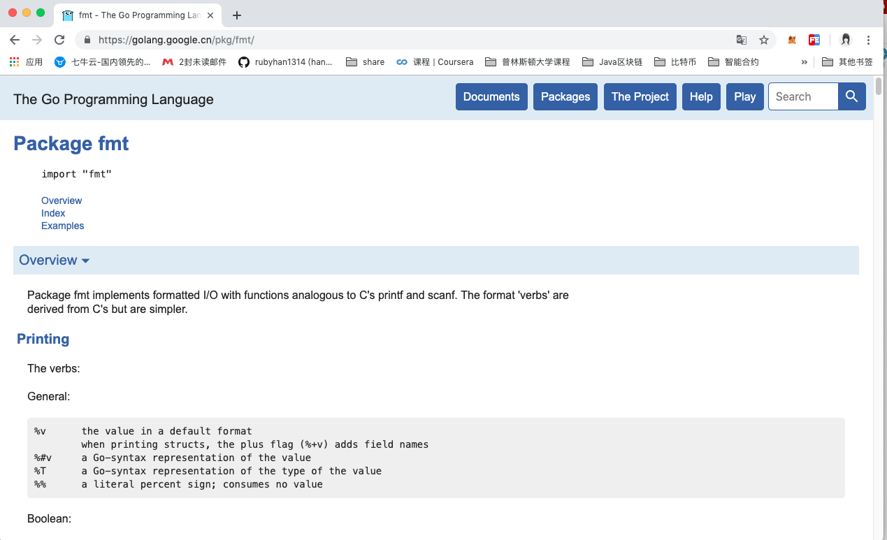

# Keyboard input and print output
> Author: Han Ru
>
>Source: Qianfeng Education
## One, print out
### 1.1 fmt package
The fmt package implements formatted I/O similar to C language printf and scanf. Formatting verb ('verb') is derived from C language but is simpler.
For details, please refer to the API of fmt on the official website: https://golang.google.cn/pkg/fmt/

### 1.2 Import package
```go
import "fmt"
```
### 1.3 Commonly used printing functions
**print:**
[func Print(a ...interface{}) (n int, err error)](https://golang.google.cn/pkg/fmt/#Print)
**Formatted printing:**
[func Printf(format string, a ...interface{}) (n int, err error)](https://golang.google.cn/pkg/fmt/#Printf)
**Wrap after printing**
[func Println(a ...interface{}) (n int, err error)](https://golang.google.cn/pkg/fmt/#Println)
Common placeholders in formatted printing:
```
Format and print placeholders:
%v, output as is
%T, print type
%t, bool type
%s, string
%f, floating point
%d, decimal integer
%b, a binary integer
%o, octal
%x, %X, hexadecimal
%x: 0-9, a-f
%X: 0-9, A-F
%c, print characters
%p, print address
. . .
```
Sample code:
```go
package main
import (
"fmt"
)
func main() {
a := 100 //int
b := 3.14 //float64
c := true // bool
d := "Hello World" //string
e := `Ruby` //string
f :='A'
fmt.Printf("%T,%b\n", a, a)
fmt.Printf("%T,%f\n", b, b)
fmt.Printf("%T,%t\n", c, c)
fmt.Printf("%T,%s\n", d, d)
fmt.Printf("%T,%s\n", e, e)
fmt.Printf("%T,%d,%c\n", f, f, f)
fmt.Println("-----------------------")
fmt.Printf("%v\n", a)
fmt.Printf("%v\n", b)
fmt.Printf("%v\n", c)
fmt.Printf("%v\n", d)
fmt.Printf("%v\n", e)
fmt.Printf("%v\n", f)
}
```
operation result:

## Two, keyboard input
### 2.1 fmt package read keyboard input
Common methods:
[func Scan(a ...interface{}) (n int, err error)](https://golang.google.cn/pkg/fmt/#Scan)
[func Scanf(format string, a ...interface{}) (n int, err error)](https://golang.google.cn/pkg/fmt/#Scanf)
[func Scanln(a ...interface{}) (n int, err error)](https://golang.google.cn/pkg/fmt/#Scanln)
```go
package main
import (
"fmt"
)
func main() {
var x int
var y float64
fmt.Println("Please enter an integer, a floating point type:")
fmt.Scanln(&x,&y)//Read keyboard input, and assign values ​​to x and y by operating the address. Blocking
fmt.Printf("The value of x: %d, the value of y: %f\n",x,y)
fmt.Scanf("%d,%f",&x,&y)
fmt.Printf("x:%d,y:%f\n",x,y)
}
```
operation result:

### 2.2 bufio package reading
Https://golang.google.talent/pkg/part IO/
The bufio package is all IO operation methods:
First create the Reader object:

Then you can read in various ways:

Sample code:
```go
package main
import (
"fmt"
"os"
"bufio"
)
func main() {
fmt.Println("Please enter a string:")
reader := bufio.NewReader(os.Stdin)
s1, _ := reader.ReadString('\n')
fmt.Println("Data read:", s1)
}
```
running result:

Qianfeng Go language learning group: 784190273
Corresponding video address:
Https://oooooo.proportion.com/video/av56018934
Https://oooooo.proportion.com/video/av47467197
Source code:
HTTPS://GitHub.com/Ruby with 1314/go_foundation
